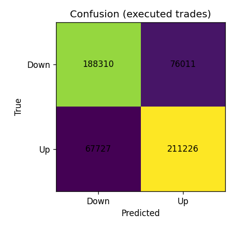
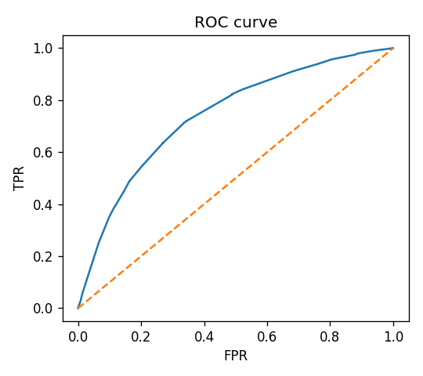
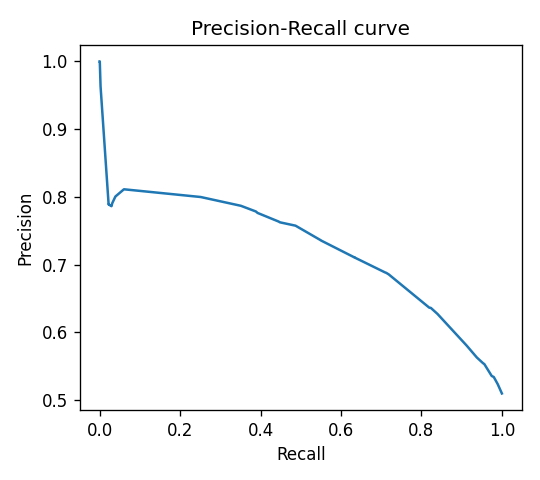
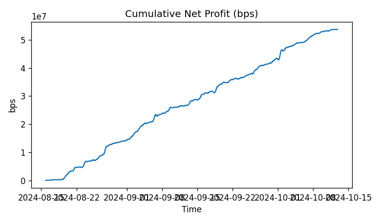
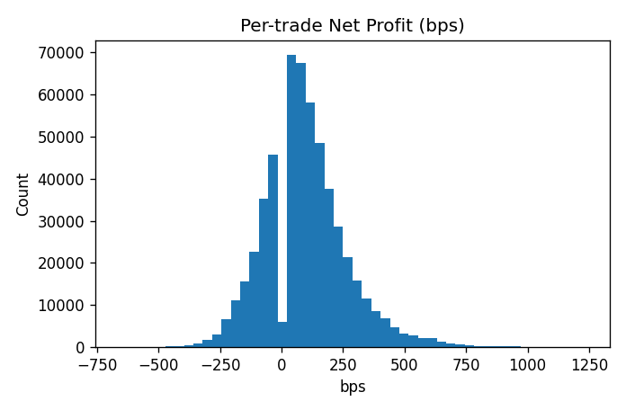
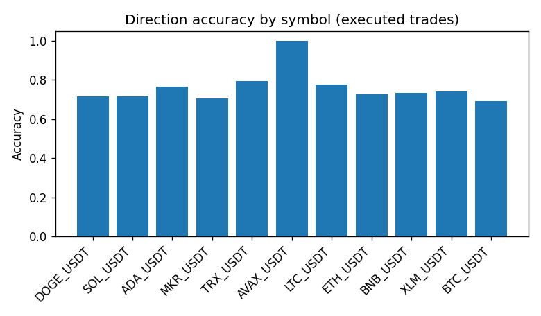
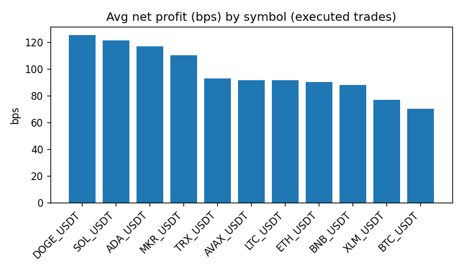

# Two-class analysis

**Experiment:** `experiments\centralized\2025-10-03_072042_mlp_h600_db20.0_2class_cal`

**Samples:** total=752870, executed=543274 (coverage=72.16%)

## Classification (executed trades)

- Accuracy: **0.7354**
- F1 macro: **0.7350**
- Precision macro: 0.7354
- Recall macro: 0.7348

## Probabilistic quality

- ROC-AUC: 0.7412
- PR-AUC: 0.7150

## Trading KPIs

- Win rate: **73.54%**
- Avg gross profit: **99.88 bps**
- Avg net profit: **98.88 bps**
- Sharpe-like (per trade): 424.941

## Plots

