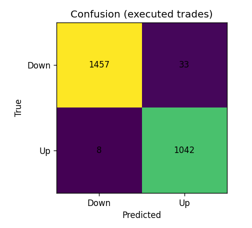
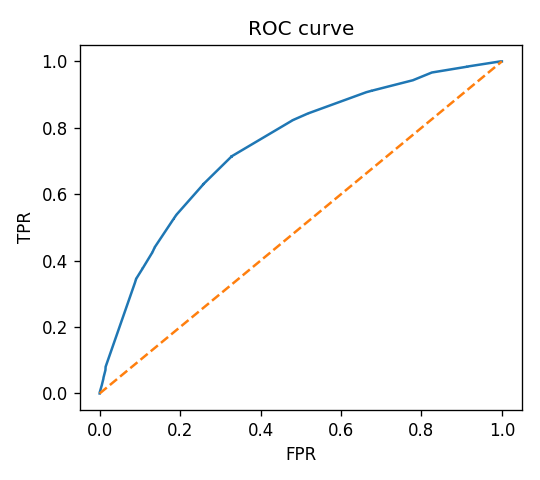
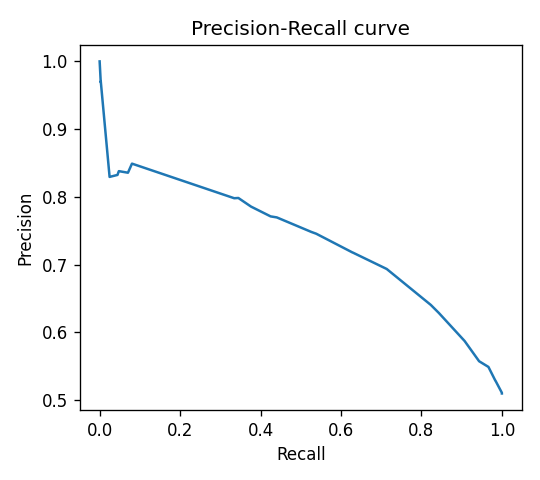
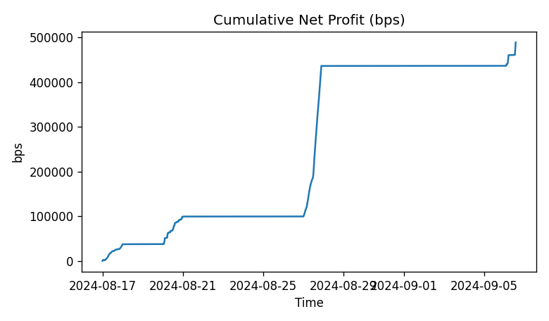
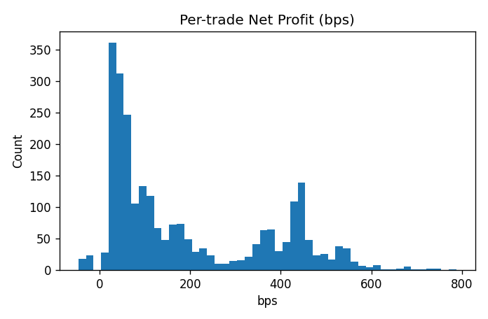
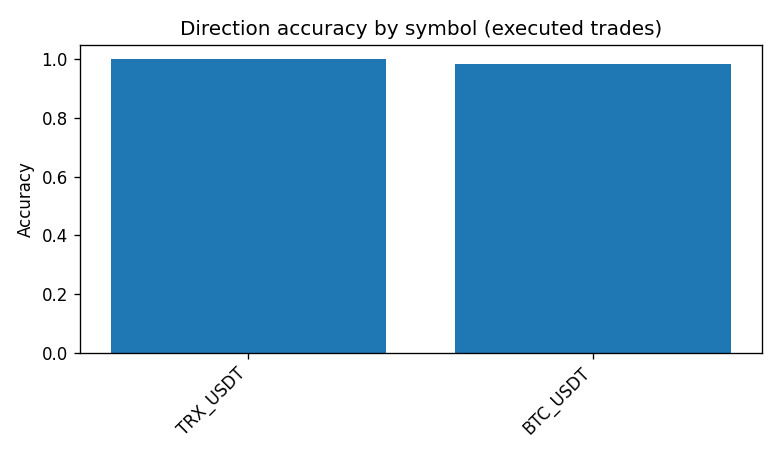
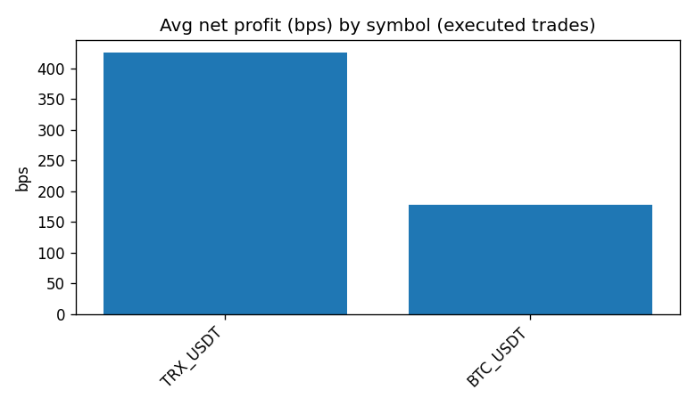

# Two-class analysis

**Experiment:** `experiments\centralized\2025-10-03_174423_mlp_h600_db20.0_2class_cal`

**Samples:** total=752870, executed=2540 (coverage=0.34%)

## Classification (executed trades)

- Accuracy: **0.9839**
- F1 macro: **0.9834**
- Precision macro: 0.9819
- Recall macro: 0.9851

## Probabilistic quality

- ROC-AUC: 0.7462
- PR-AUC: 0.7205

## Trading KPIs

- Win rate: **98.39%**
- Avg gross profit: **193.51 bps**
- Avg net profit: **192.51 bps**
- Sharpe-like (per trade): 54.905

## Plots

